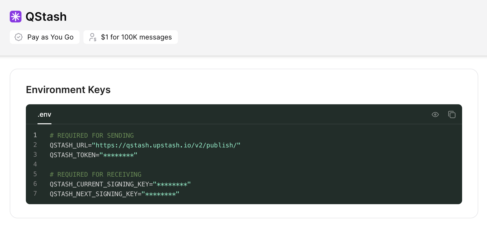

# Upstash RAG Chat SDK

The `@upstash/rag-chat` package makes it easy to develop powerful retrieval-augmented generation (RAG) chat applications with minimal setup and configuration.

Features:

- Next.js compatibility with streaming support
- Ingest entire websites, PDFs and more out of the box
- Built-in Vector store for your knowledge base
- (Optional) built-in Redis compatibility for fast chat history management
- (Optional) built-in rate limiting

## Getting started

### Installation

Install the package using your preferred package manager:

```sh
pnpm add @upstash/rag-chat

bun add @upstash/rag-chat

npm i @upstash/rag-chat
```

### Quick start

1. Set up your environment variables:

```sh
UPSTASH_VECTOR_REST_URL="XXXXX"
UPSTASH_VECTOR_REST_TOKEN="XXXXX"


# if you use OpenAI compatible models
OPENAI_API_KEY="XXXXX"

# or if you use Upstash hosted models
QSTASH_TOKEN="XXXXX"

# Optional: For Redis-based chat history (default is in-memory)
UPSTASH_REDIS_REST_URL="XXXXX"
UPSTASH_REDIS_REST_TOKEN="XXXXX"
```

2. Initialize and use RAGChat:

```typescript
import { RAGChat } from "@upstash/rag-chat";

const ragChat = new RAGChat();

const response = await ragChat.chat("Tell me about machine learning");
console.log(response);
```

### Configuring Your Chat Model

RAGChat supports both Upstash-hosted models and all OpenAI and OpenAI-compatible models out of the box:

#### Using OpenAI Models

To use an OpenAI model, first initialize RAGChat:

```typescript
import { RAGChat, openaiModel } from "@upstash/rag-chat";

export const ragChat = new RAGChat({
  model: openaiModel("gpt-4-turbo"),
});
```

And set your OpenAI API key as an environment variable:

```bash
OPENAI_API_KEY=...
```

#### Using Upstash-hosted Open-Source Models

To use an Upstash model, first initialize RAGChat:

```typescript
import { RAGChat, upstashModel } from "@upstash/rag-chat";

export const ragChat = new RAGChat({
  model: upstashModel("mistralai/Mistral-7B-Instruct-v0.2"),
});
```

#### Using Custom Providers - TogetherAi, Replicate

To use an Upstash model, first initialize RAGChat:

````typescript
import { RAGChat, upstashModel } from "@upstash/rag-chat";

export const ragChat = new RAGChat({
  model: customModel("codellama/CodeLlama-70b-Instruct-hf", {
      apiKey: "TOGETHER_AI_TOKEN",
      baseUrl: "https://api.together.xyz/v1",
    }),
});

And set your Upstash QStash API key environment variable:

```bash
QSTASH_TOKEN=...
````

<details>
  <summary>Where do I find my Upstash API key?</summary><br>

- Navigate to your [Upstash QStash Console](https://console.upstash.com/qstash).
- Scroll down to the **Environment Keys** section and copy the `QSTASH_TOKEN` to your `.env` file.
- 

</details>

### Advanced Configuration

Customize your RAGChat instance with advanced options:

```typescript
import { RAGChat, openaiModel } from "@upstash/rag-chat";

// 👇 Optional: For built-in rate limiting
import { Ratelimit } from "@upstash/ratelimit";
import { Redis } from "@upstash/redis";

export const ragChat = new RAGChat({
  model: openaiModel("gpt-4-turbo"),

  prompt: ({ context, question, chatHistory }) =>
    `You are an AI assistant with access to an Upstash Vector Store.
  Use the provided context and chat history to answer the question.
  If the answer isn't available, politely inform the user.
  ------
  Chat history:
  ${chatHistory}
  ------
  Context:
  ${context}
  ------
  Question: ${question}
  Answer:`,

  ratelimit: new Ratelimit({
    redis: Redis.fromEnv(),
    limiter: Ratelimit.slidingWindow(10, "10 s"),
  }),
});
```

### Managing Your Knowledge Base

Add various types of data to your RAG application:

#### Adding Text

```typescript
await ragChat.context.add({
  type: "text",
  data: "The speed of light is approximately 299,792,458 meters per second.",
});
```

#### Adding PDF Content

```typescript
await ragChat.context.add({
  type: "pdf",
  fileSource: "./data/quantum_computing_basics.pdf",

  // optional 👇: only add this knowledge to a specific namespace
  options: { namespace: "user-123-documents" },
});
```

#### Adding Web Content

```typescript
await ragChat.context.add({
  type: "html",
  source: "https://en.wikipedia.org/wiki/Quantum_computing",

  // optional 👇: custom page parsing settings
  config: { chunkOverlap: 50, chunkSize: 200 },
});
```

#### Removing Content

Remove specific documents:

```typescript
await ragChat.context.delete({ id: "1", namespace: "user-123-documents" });
```

### Managing Chat History

RAGChat provides robust functionality for interacting with and managing chat history. This allows you to maintain context, review past interactions, and customize the conversation flow.

#### Retrieving Chat History

Fetch recent messages from the chat history:

```typescript
const history = await ragChat.history.getMessages({ amount: 10 });
console.log(history); // 👈 Last (up to) 10 messages
```

You can also specify a session ID to retrieve history for a particular conversation:

```typescript
const sessionHistory = await ragChat.history.getMessages({
  amount: 5,
  sessionId: "user-123-session",
});
```

#### Deleting Chat History

Remove chat history for a specific session:

```typescript
ragChat.history.deleteMessages({ sessionId: "user-123-session" });
```

#### Adding Custom Messages

Injecting custom messages into the chat history:

```typescript
// Adding a user message
await ragChat.history.addMessage({
  message: { content: "What's the weather like?", role: "user" },
});

// Adding a system message
await ragChat.history.addMessage({
  message: {
    content: "The AI should provide weather information.",
    role: "system",
  },
});
```

## Example usage

### Nextjs route handlers

RAGChat integrates with Next.js route handlers out of the box. Here's how to use it:

#### Basic usage

```typescript
import { ragChat } from "@/utils/rag-chat";
import { NextResponse } from "next/server";

export const POST = async (req: Request) => {
  // 👇 user message
  const { message } = await req.json();
  const { output } = await ragChat.chat(message);
  return NextResponse.json({ output });
};
```

#### Streaming responses

To stream the response from a route handler:

```typescript
import { ragChat } from "@/utils/rag-chat";

export const POST = async (req: Request) => {
  const { message } = await req.json();
  const { output } = await ragChat.chat(message, { streaming: true });
  return new Response(output);
};
```

On the frontend, you can read the streamed data like this:

```typescript
"use client"

export const ChatComponent = () => {
  const [response, setResponse] = useState('');

  async function fetchStream() {
    const response = await fetch("/api/chat", {
      method: "POST",
      body: JSON.stringify({ message: "Your question here" }),
    });

    if (!response.body) {
      console.error("No response body");
      return;
    }

    const reader = response.body.getReader();
    const decoder = new TextDecoder();

    while (true) {
      const { done, value } = await reader.read();
      if (done) break;

      const chunk = decoder.decode(value, { stream: true });
      setResponse(prev => prev + chunk);
    }
  }

  useEffect(() => {
    fetchStream();
  }, []);

  return <div>{response}</div>;
}
```

### Nextjs server actions

RAGChat supports Next.js server actions natively. First, define your server action:

```typescript
"use server";

import { ragChat } from "@/utils/rag-chat";
import { createServerActionStream } from "@upstash/rag-chat/nextjs";

export const serverChat = async (message: string) => {
  const { output } = await ragChat.chat(message, { streaming: true });

  // 👇 adapter to let us stream from server actions
  return createServerActionStream(output);
};
```

Second, use the server action in your client component:

```typescript
"use client";

import { readServerActionStream } from "@upstash/rag-chat/nextjs";

export const ChatComponent = () => {
  const [response, setResponse] = useState('');

  const clientChat = async () => {
    const stream = await serverChat("How are you?");

    for await (const chunk of readServerActionStream(stream)) {
      setResponse(prev => prev + chunk);
    }
  };

  return (
    <div>
      <button onClick={clientChat}>Start Chat</button>
      <div>{response}</div>
    </div>
  );
};
```

### Vercel AI SDK Integration

RAGChat can be easily integrated with the Vercel AI SDK. First, set up your route handler:

```typescript
import { aiUseChatAdapter } from "@upstash/rag-chat/nextjs";
import { ragChat } from "@/utils/rag-chat";

export async function POST(req: Request) {
  const { messages } = await req.json();
  const lastMessage = messages[messages.length - 1].content;

  const response = await ragChat.chat(lastMessage, { streaming: true });
  return aiUseChatAdapter(response);
}
```

Second, use the `useChat` hook in your frontend component:

```typescript
"use client"

import { useChat } from "ai/react";

const ChatComponent = () => {
  const { messages, input, handleInputChange, handleSubmit } = useChat({
    api: "/api/chat",
    initialInput: "What year was the construction of the Eiffel Tower completed, and what is its height?",
  });

  return (
    <div>
      <ul>
        {messages.map((m) => (
          <li key={m.id}>{m.content}</li>
        ))}
      </ul>

      <form onSubmit={handleSubmit}>
        <input
          value={input}
          onChange={handleInputChange}
          placeholder="Ask a question..."
        />
        <button type="submit">Send</button>
      </form>
    </div>
  );
};
```
